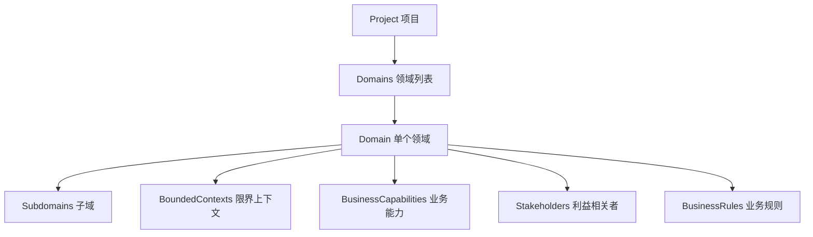

# 🎯 Project-Domain 关系架构补充报告

## 🚨 发现的架构缺陷

你的观察非常准确！在现有的Schema结构中发现了两个关键缺失：

### 1. **缺少 Domain 实体定义**
- ❌ **没有独立的 `domain.schema.json`** 
- ✅ 只有 `subdomain.schema.json` (子域)
- ❌ **Domain实体定义完全缺失**

### 2. **Project → Domains 关系缺失**  
- ❌ **`project-metadata.schema.json` 中没有 `domains` 属性**
- ❌ **无法建立项目与领域的直接关联**
- ❌ **DDD架构的核心关系链断裂**

## ✅ 架构修复方案

### 🎯 新增文件结构

```
project-metadata.schemas/
├── full/
│   ├── project-metadata.schema.json  ← 已更新：添加domains属性
│   └── domain.schema.json            ← 新增：完整的Domain实体定义
└── fields/
    └── domain-fields.schema.json     ← 新增：Domain相关字段定义
```

### 🎯 架构关系链



## 🎯 Domain Schema 核心特性

### **1. 领域分类**
```json
{
  "type": "CORE|SUPPORTING|GENERIC",
  "priority": "HIGH|MEDIUM|LOW", 
  "complexity": "SIMPLE|MEDIUM|COMPLEX|VERY_COMPLEX"
}
```

### **2. 业务能力管理**
```json
{
  "businessCapabilities": [
    {
      "capabilityId": "capability_user_management",
      "name": "用户管理",
      "level": "L1",
      "maturity": "DEFINED"
    }
  ]
}
```

### **3. 利益相关者追踪**
```json
{
  "stakeholders": [
    {
      "stakeholderId": "stakeholder_product_owner",
      "name": "产品负责人",
      "role": "PRODUCT_OWNER",
      "influence": "HIGH"
    }
  ]
}
```

### **4. 业务规则定义**
```json
{
  "businessRules": [
    {
      "ruleId": "rule_user_unique_email",
      "name": "用户邮箱唯一性",
      "type": "BUSINESS_RULE",
      "priority": "CRITICAL"
    }
  ]
}
```

### **5. 领域指标统计**
```json
{
  "metrics": {
    "boundedContextCount": 3,
    "aggregateCount": 8,
    "entityCount": 15,
    "domainServiceCount": 5
  }
}
```

## 🎯 Project Schema 更新

### **新增 domains 属性**
```json
{
  "domains": {
    "type": "array",
    "items": { "$ref": "./domain.schema.json" },
    "minItems": 1,
    "description": "项目包含的业务领域列表"
  }
}
```

### **更新 required 字段**
```json
{
  "required": ["version", "projectId", "projectInfo", "teamInfo", "domains"]
}
```

## 🎯 架构优势

### **1. 完整的DDD关系链**
- ✅ Project → Domains → Subdomains → BoundedContexts
- ✅ 符合DDD分层架构原则

### **2. 业务价值清晰化**
- ✅ 核心域、支撑域、通用域分类
- ✅ 优先级和复杂度评估

### **3. 利益相关者管理**  
- ✅ 角色定义和影响力评估
- ✅ 支持跨职能团队协作

### **4. 业务规则治理**
- ✅ 规则分类和优先级管理
- ✅ 规则来源追溯

### **5. 数据驱动决策**
- ✅ 领域指标统计
- ✅ 架构复杂度量化

## 🎯 使用示例

```json
{
  "version": "2.0.0",
  "projectId": "project_ecommerce_platform",
  "projectInfo": { ... },
  "teamInfo": { ... },
  "domains": [
    {
      "domainId": "domain_user_management",
      "name": "用户管理域",
      "type": "CORE",
      "priority": "HIGH",
      "complexity": "MEDIUM",
      "boundedContexts": ["context_user_auth", "context_user_profile"],
      "businessCapabilities": [...],
      "stakeholders": [...],
      "businessRules": [...],
      "metrics": {...}
    },
    {
      "domainId": "domain_order_management", 
      "name": "订单管理域",
      "type": "CORE",
      "priority": "HIGH",
      "complexity": "COMPLEX",
      ...
    }
  ]
}
```

## 🎯 总结

通过补充 **Domain 实体定义** 和 **Project-Domain 关系**，现在具备了：

1. ✅ **完整的DDD架构关系链**
2. ✅ **业务领域的全面建模能力** 
3. ✅ **项目-领域-子域-上下文的清晰层次**
4. ✅ **利益相关者和业务规则的统一管理**
5. ✅ **数据驱动的架构决策支持**

**这是DDD元数据平台架构的重要完善！** 🎉
