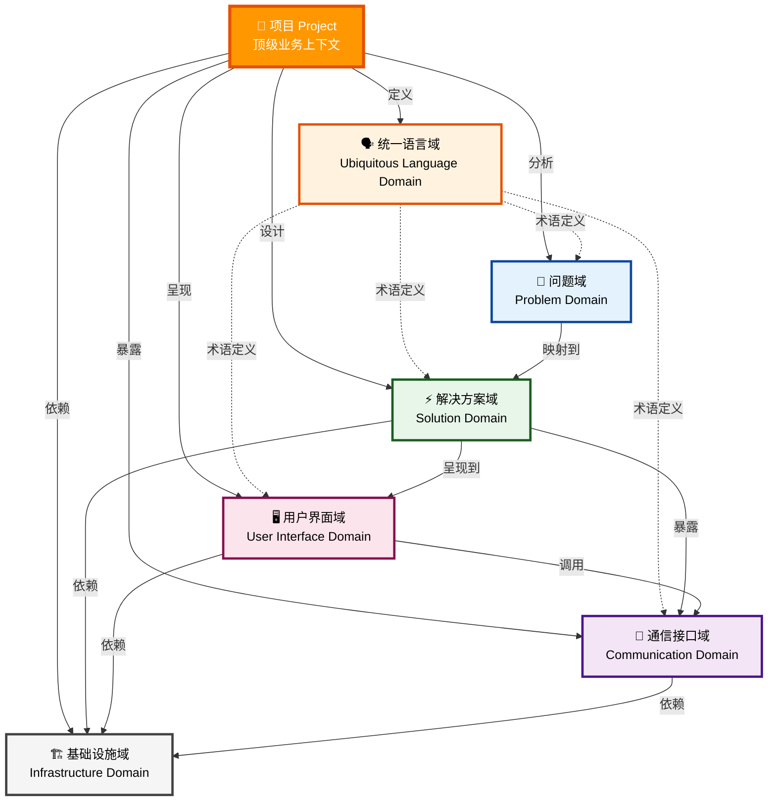
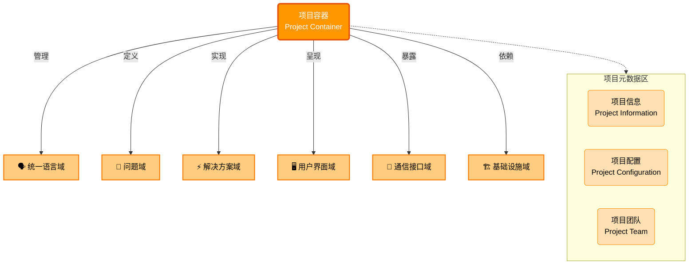
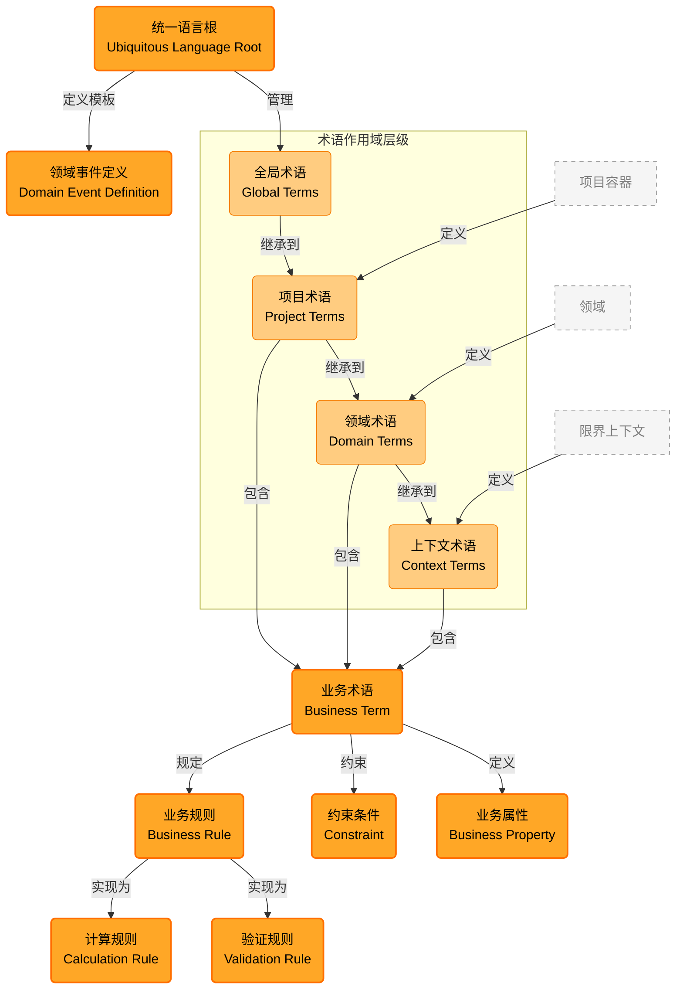
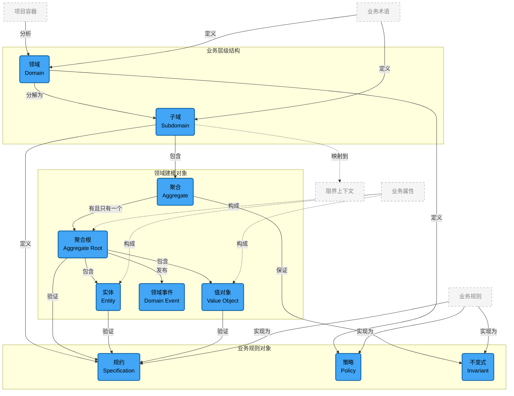
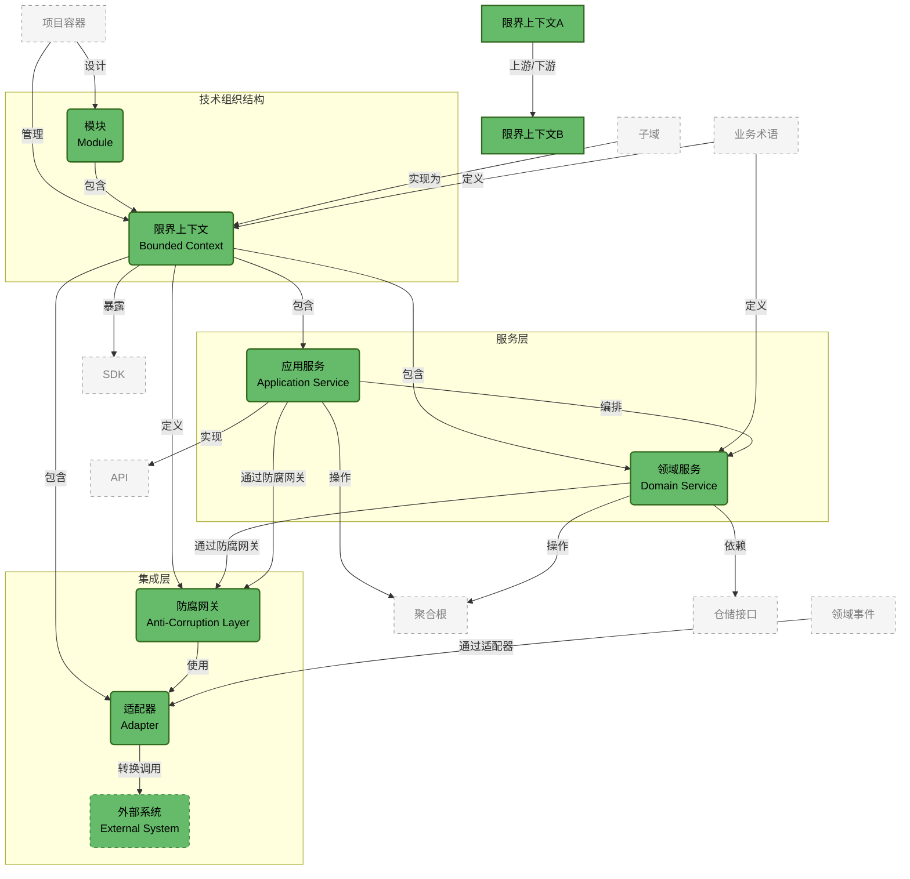
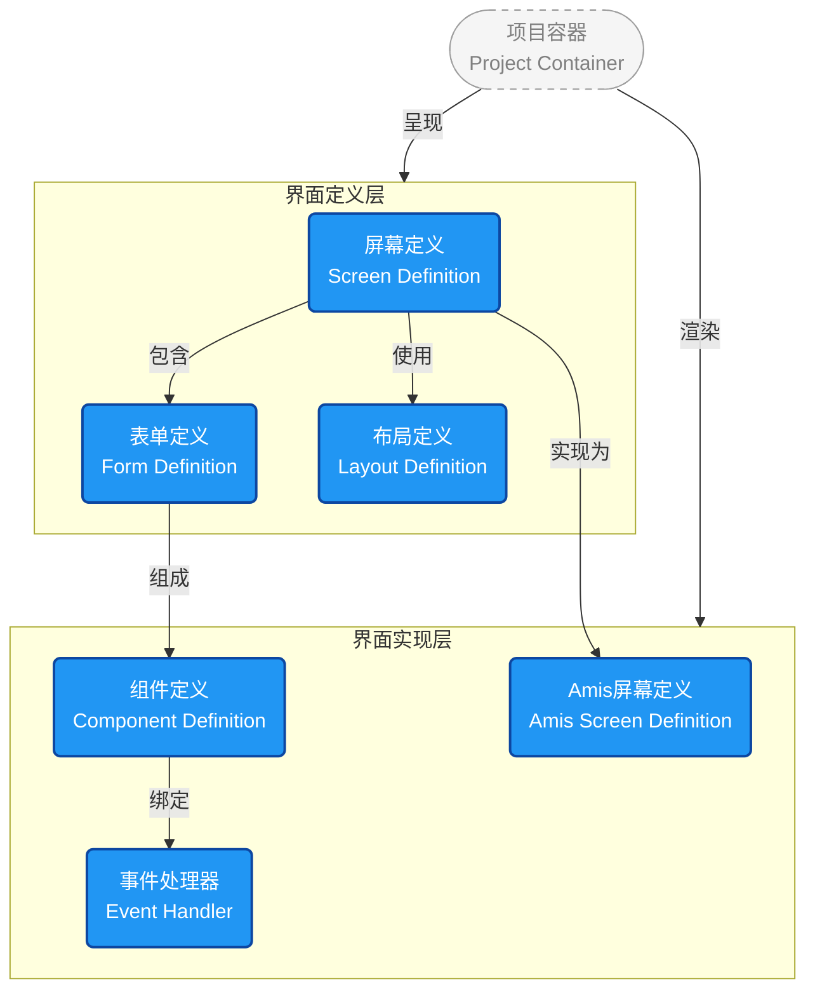
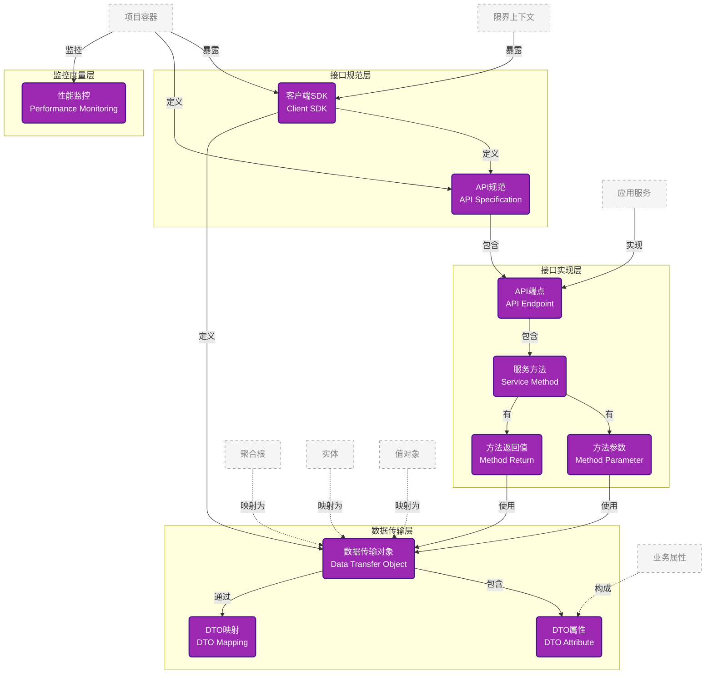
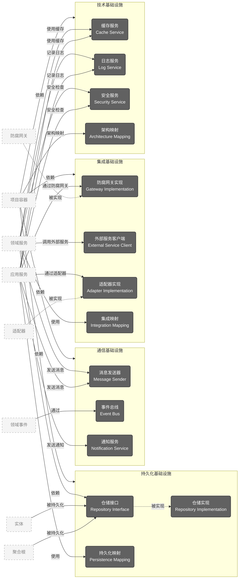

# 📐 DDD元数据平台 - Schema架构层级├── 🖥️ 用户├── 📡 通信接口域 (Communication Domain) - 对外暴露接口
│   ├── SDK (Software Development Kit)
│   ├── API (Application Programming Interface)
│   ├── DTO (Data Transfer Object)
│   ├── DTO映射 (DTO Mapping)
│   └── 性能监控 (Performance Monitoring)ser Interface Domain) - 用户交互界面
│   ├── 屏幕定义 (Screen Definition)
│   ├── Amis屏幕定义 (Amis Screen Definition)
│   ├── 表单定义 (Form Definition)
│   ├── 布局定义 (Layout Definition)
│   └── 组件定义 (Component Definition)
├── 📡 通信接口域 (Communication Domain) - 对外暴露接口 对象层级关系 - 项目驱动的分层分区架构

### 🎯 **核心层级关系澄清**
```
📁 项目 (Project) - 顶级视角
├── 🗣️ 统一语言 (Ubiquitous Language) - 项目级术语体系
│   ├── 业务术语 (Business Terms)
│   ├── 业务属性 (Business Properties)
│   ├── 约束条件 (Constraints)
│   ├── 业务规则 (Business Rules)
│   ├── 验证规则 (Validation Rules)
│   ├── 计算规则 (Calculation Rules)
│   └── 领域事件定义 (Domain Event Definitions)
├── 🎯 问题域 (Problem Domain) - 要解决的业务问题
│   ├── 领域 (Domain) + 策略 (Policy)
│   ├── 子域 (Subdomain) + 规约 (Specification)
│   └── 聚合 (Aggregate) + 实体 (Entity) + 值对象 (Value Object) + 不变式 (Invariant)
├── ⚡ 解决方案域 (Solution Domain) - 技术实现方案
│   ├── 模块 (Module)
│   ├── 限界上下文 (Bounded Context)
│   ├── 领域服务 (Domain Service)
│   ├── 应用服务 (Application Service)
│   ├── 适配器 (Adapter) + 防腐网关 (Anti-Corruption Layer)
│   └── 外部系统 (External System)
├── �️ 用户界面域 (User Interface Domain) - 用户交互界面
│   ├── 界面定义 (Screen Definition)
│   ├── Amis界面定义 (Amis Screen Definition)
│   ├── 组件库 (Component Library)
│   ├── 界面主题 (UI Theme)
│   └── 用户体验配置 (UX Configuration)
├── �📡 通信接口域 (Communication Domain) - 对外暴露接口
│   ├── SDK (Software Development Kit)
│   ├── API (Application Programming Interface)
│   ├── DTO (Data Transfer Object)
│   ├── DTO映射 (DTO Mapping)
│   └── 性能监控 (Performance Monitoring)
└── 🏗️ 基础设施域 (Infrastructure Domain) - 技术支撑服务
    ├── 持久化服务 (Persistence Services)
    ├── 通信服务 (Communication Services)
    ├── 集成服务 (Integration Services)
    └── 技术服务 (Technical Services)
```

### 🏗️ **第一层：项目架构总览图**


### 🔍 **第二层：域详细图**

#### 📁 **0. 项目容器层 - Project Container**


#### 🗣️ **1. 统一语言域 - Ubiquitous Language Domain**


#### 🎯 **2. 问题域 - Problem Domain**


#### ⚡ **3. 解决方案域 - Solution Domain**


#### �️ **4. 用户界面域 - User Interface Domain**

用户界面域负责定义与用户交互的各种界面组件和表现形式。



**用户界面域组件说明:**

- **屏幕定义**: 定义通用的屏幕界面结构和布局规范
- **表单定义**: 定义数据输入表单的结构和验证规则  
- **布局定义**: 定义界面的排版和视觉呈现方式
- **Amis屏幕定义**: 基于Amis框架的具体屏幕实现配置
- **组件定义**: 定义可复用的UI组件和其属性
- **事件处理器**: 定义用户交互事件的处理逻辑

### 📊 B端应用屏幕类型分类

#### 4.1 业务页面类型 (Business Screen Types)
| 类型 | 枚举值 | 描述 | 适用场景 |
|------|--------|------|----------|
| 列表页面 | LIST_PAGE | 数据列表展示和管理 | 用户列表、订单列表、商品列表 |
| 详情页面 | DETAIL_PAGE | 单条数据详情展示 | 用户详情、订单详情、商品详情 |
| 编辑页面 | EDIT_PAGE | 数据录入和修改 | 新增用户、编辑订单、修改商品 |
| 主从页面 | MASTER_DETAIL_PAGE | 主表+子表联动 | 订单+明细、项目+任务 |
| 树表页面 | TREE_TABLE_PAGE | 树形结构+表格 | 部门树+员工、分类树+商品 |
| 仪表盘页面 | DASHBOARD_PAGE | 数据统计和图表 | 业务看板、数据分析 |
| 报表页面 | REPORT_PAGE | 数据分析和导出 | 销售报表、财务报表 |
| 流程页面 | WORKFLOW_PAGE | 审批和工作流 | 审批流程、业务流程 |

#### 4.2 对话框类型 (Dialog Types)
| 类型 | 枚举值 | 描述 | 适用场景 |
|------|--------|------|----------|
| 确认对话框 | CONFIRM_DIALOG | 操作确认提示 | 删除确认、提交确认 |
| 编辑对话框 | EDIT_DIALOG | 弹窗编辑表单 | 快速编辑、批量编辑 |
| 选择对话框 | SELECT_DIALOG | 数据选择器 | 选择用户、选择部门 |
| 详情对话框 | DETAIL_DIALOG | 弹窗详情展示 | 快速查看、预览 |
| 自定义对话框 | CUSTOM_DIALOG | 业务自定义内容 | 特殊业务流程 |
| 向导对话框 | WIZARD_DIALOG | 分步操作引导 | 配置向导、引导流程 |

#### 4.3 通知信息类型 (Notification Types)
| 类型 | 枚举值 | 描述 | 适用场景 |
|------|--------|------|----------|
| 消息提示 | MESSAGE_TOAST | 轻量级反馈提示 | 成功提示、错误提示 |
| 通知栏 | NOTIFICATION_BAR | 系统通知消息 | 系统公告、待办提醒 |
| 警告框 | ALERT_BOX | 重要信息提醒 | 系统警告、风险提示 |
| 状态信息 | STATUS_INFO | 系统状态显示 | 连接状态、同步状态 |
| 进度提示 | PROGRESS_NOTIFICATION | 操作进度反馈 | 上传进度、处理进度 |
| 提示信息 | TOOLTIP | 帮助说明 | 字段说明、操作提示 |
| 气泡框 | POPOVER | 详细信息展示 | 详细说明、扩展信息 |

#### 4.4 布局容器类型 (Layout Container Types)
| 类型 | 枚举值 | 描述 | 适用场景 |
|------|--------|------|----------|
| 容器布局 | CONTAINER_LAYOUT | 基础容器 | 页面容器、区域容器 |
| 网格布局 | GRID_LAYOUT | 栅格系统布局 | 响应式布局、多列布局 |
| 弹性布局 | FLEX_LAYOUT | Flex布局 | 灵活排列、自适应 |
| 标签布局 | TAB_LAYOUT | 多标签页 | 分组展示、切换视图 |
| 手风琴布局 | ACCORDION_LAYOUT | 折叠面板 | 分组收纳、节省空间 |
| 抽屉布局 | DRAWER_LAYOUT | 侧边栏抽屉 | 侧边导航、辅助面板 |

### 📝 B端应用数据类型分类

#### 4.5 常见数据类型 (Common Data Types)
| 数据类型 | 枚举值 | 描述 | 典型场景 |
|----------|--------|------|----------|
| 配置类数据 | CONFIGURATION | 纯配置项、参数设置 | 系统参数、字典配置 |
| 单表数据 | SINGLE_TABLE | 单表数据管理 | 用户管理、部门管理 |
| 主子表数据 | MASTER_DETAIL | 一主一子表结构 | 订单+明细、发票+行项 |
| 主多子表数据 | MASTER_MULTI_DETAIL | 一主多子表结构 | 项目+成员+任务 |
| 交叉表数据 | CROSS_TABLE | 行列动态交叉 | 销售统计、库存分布 |
| 树型结构数据 | TREE_STRUCTURE | 层级树形结构 | 组织架构、分类管理 |
| 多维关联数据 | MULTI_DIMENSIONAL | 复杂多表关联 | 综合分析、复杂查询 |

### 🎨 表单布局与字段配置

#### 4.6 表单布局类型 (Form Layout Types)
| 布局类型 | 枚举值 | 描述 | 适用场景 |
|----------|--------|------|----------|
| 网格布局 | GRID | 基于网格系统的布局 | 标准表单、响应式表单 |
| 弹性布局 | FLEX | 基于Flexbox的布局 | 灵活排列、动态调整 |
| 表格布局 | TABLE | 基于表格的布局 | 对齐要求严格的表单 |
| 自由布局 | FREE | 自由定位布局 | 设计器、特殊布局需求 |

#### 4.7 字段布局规则 (Field Layout Rules)

**智能布局规则示例:**

1. **长文本字段自动独占一行**
   - 匹配规则: `.*?(备注|说明|描述|地址|详情|remark|note|desc|address|detail).*?`
   - 布局设置: `span: 12, fullWidth: true, newLine: true`

2. **特殊字段类型自动布局**
   - 富文本编辑器: 独占一行
   - 文件上传: 独占一行  
   - 图片上传: 独占一行
   - 文本域: 独占一行

3. **响应式列数控制**
   - 超小屏幕(xs): 1列
   - 小屏幕(sm): 1-2列
   - 中等屏幕(md): 2-3列
   - 大屏幕(lg): 3-4列
   - 超大屏幕(xl): 3-4列

#### 4.8 预设布局模板 (Layout Presets)

| 预设名称 | 适用场景 | 特点 |
|----------|----------|------|
| 标准业务表单 | 大多数业务表单 | 2列布局，响应式，智能规则 |
| 紧凑表单 | 字段较多的表单 | 3-4列布局，紧凑间距 |
| 详情查看表单 | 只读详情页面 | 2列布局，标签在左，间距较大 |
| 单列表单 | 简单表单或移动端 | 1列布局，标签在上 |
| 移动端表单 | 移动设备 | 响应式单列，标签在上 |

#### �📡 **5. 通信接口域 - Communication Domain**


#### 🏗️ **6. 基础设施域 - Infrastructure Domain**


