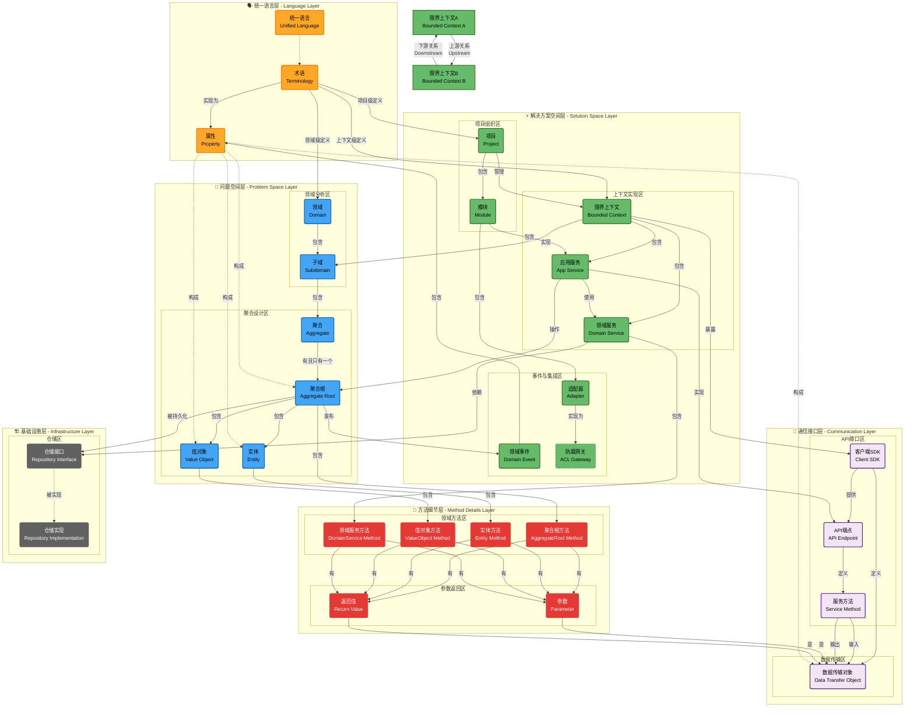

# 📐 DDD元数据平台 - Schema架构层级关系

## 🎯 当前问题分析

### ❌ **概念混淆问题**
1. **战略设计、战术设计被误认为数据对象** - 实际上它们是**过程性活动**，应该体现在API/UI层，而不是Schema层
2. **层级关系不清晰** - 项目、领域、限界上下文、子域之间的关系模糊
3. **术语作用域混乱** - 没有明确区分全局、项目、领域、上下文级别的术语

## 📊 当前Schema对象清单

### 🗂️ **1. project-metadata.schemas/**
```
project-metadata.schemas/
├── full/
│   ├── project-metadata.schema.json    ← 项目元数据聚合根
│   └── domain.schema.json              ← 领域定义
├── fields/
│   ├── project-fields.schema.json
│   ├── domain-fields.schema.json
│   ├── business-fields.schema.json
│   ├── team-fields.schema.json
│   └── technical-fields.schema.json
└── operations/
    ├── create/, update/, delete/, read/, patch/, bulk/
```

### 🗂️ **2. strategic-design.schemas/** ⚠️ **可能需要重构**
```
strategic-design.schemas/
├── full/
│   ├── strategic-design.schema.json    ← ❌ 过程性活动，不应该是数据对象
│   ├── bounded-context.schema.json     ← ✅ 限界上下文实体
│   └── subdomain.schema.json          ← ✅ 子域实体
├── fields/
│   ├── bounded-context-fields.schema.json
│   └── subdomain-fields.schema.json
└── operations/
```

### 🗂️ **3. tactical-design.schemas/** ⚠️ **可能需要重构**
```
tactical-design.schemas/
├── full/
│   ├── tactical-design.schema.json     ← ❌ 过程性活动，不应该是数据对象
│   ├── aggregate.schema.json          ← ✅ 聚合根实体
│   ├── entity.schema.json            ← ✅ 实体对象
│   └── value-object.schema.json       ← ✅ 值对象
├── fields/
│   ├── aggregate-fields.schema.json
│   ├── entity-fields.schema.json
│   └── value-object-fields.schema.json
└── operations/
```

### 🗂️ **4. ubiquitous-language.schemas/**
```
ubiquitous-language.schemas/
├── full/
│   ├── ubiquitous-language.schema.json ← 统一语言聚合根
│   ├── business-term.schema.json      ← ✅ 业务术语
│   ├── business-attribute.schema.json ← ✅ 业务属性
│   └── constraints.schema.json        ← ✅ 约束条件
├── fields/
│   ├── term-fields.schema.json
│   └── attribute-fields.schema.json
└── operations/
```

### 🗂️ **5. data-transfer-objects.schemas/**
```
data-transfer-objects.schemas/
├── full/
│   ├── data-transfer-objects.schema.json   ← DTO管理聚合根
│   ├── data-transfer-object.schema.json    ← ✅ 单个DTO实体
│   ├── dto-attribute.schema.json          ← ✅ DTO属性
│   ├── dto-mapping.schema.json            ← ✅ DTO映射
│   ├── field-mapping.schema.json          ← ✅ 字段映射
│   ├── serialization.schema.json          ← ✅ 序列化配置
│   ├── transformation-rule.schema.json    ← ✅ 转换规则
│   ├── validation-rule.schema.json        ← ✅ 验证规则
│   ├── usage-status.schema.json           ← ✅ 使用状态
│   ├── constraints.schema.json            ← ✅ 约束条件
│   └── attribute-serialization.schema.json ← ✅ 属性序列化
├── fields/
│   ├── dto-fields.schema.json
│   ├── attribute-fields.schema.json
│   ├── mapping-fields.schema.json
│   ├── serialization-fields.schema.json
│   ├── validation-fields.schema.json
│   ├── collection-fields.schema.json
│   └── common-fields.schema.json
└── operations/
```

### 🗂️ **6. api-definition.schemas/**
```
api-definition.schemas/
├── full/
│   └── api-specification.schema.json   ← ✅ API规范定义
├── fields/
│   ├── endpoint-fields.schema.json
│   ├── parameter-fields.schema.json
│   ├── response-fields.schema.json
│   └── common-fields.schema.json
└── operations/
```

### 🗂️ **7. implementation-mapping.schemas/**
```
implementation-mapping.schemas/
├── full/
│   ├── implementation-mapping.schema.json  ← 实现映射聚合根
│   ├── architecture-mapping.schema.json   ← ✅ 架构映射
│   ├── persistence-mapping.schema.json    ← ✅ 持久化映射
│   └── integration-mapping.schema.json    ← ✅ 集成映射
├── fields/
│   ├── architecture-fields.schema.json
│   ├── persistence-fields.schema.json
│   ├── integration-fields.schema.json
│   ├── mapping-fields.schema.json
│   ├── validation-fields.schema.json
│   └── common-fields.schema.json
└── operations/
```

### 🗂️ **8. screen-definition.schemas/**
```
screen-definition.schemas/
├── full/
│   ├── screen-definition.schema.json   ← 界面定义聚合根
│   ├── screen.schema.json             ← ✅ 界面实体
│   ├── component.schema.json          ← ✅ 组件实体
│   ├── action.schema.json             ← ✅ 操作实体
│   └── permission.schema.json         ← ✅ 权限实体
├── fields/
└── operations/
```
---

```mermaid

```


### 🗂️ **9. validation.schemas/**
```
validation.schemas/
├── full/
│   ├── validation-configuration.schema.json ← 验证配置聚合根
│   └── validation-rule.schema.json         ← ✅ 验证规则实体
├── fields/
└── operations/
```

##  对象层级关系 - 分层分区架构


## 🎯 **需要矫正的层级关系**

### **❓ 问题1: 项目与领域关系**
- **当前**: project-metadata包含domains数组
- **关系**: Project 1:N Domain ✅ 这个是对的

### **❓ 问题2: 领域与限界上下文关系**
- **当前**: domain包含boundedContexts ID数组
- **关系**: Domain 1:N BoundedContext 
- **疑问**: 这个关系对吗？还是应该是 BoundedContext可以跨多个Domain？

### **❓ 问题3: 领域与子域关系**
- **当前**: domain包含subdomains数组，subdomain引用strategic-design
- **关系**: Domain 1:N Subdomain
- **疑问**: 这个关系对吗？

### **❓ 问题4: 限界上下文与子域关系**
- **当前**: 没有明确的关系定义
- **疑问**: 1个限界上下文通常有多个子域？还是1个子域可以属于多个限界上下文？

### **❓ 问题5: 术语的作用域层级**
- **当前**: ubiquitous-language是全局的
- **需要**: 明确术语的作用域：全局 → 项目 → 领域 → 上下文

### **❓ 问题6: 战略设计和战术设计的定位**
- **当前**: 作为数据对象Schema
- **实际**: 应该是过程性活动，在API/UI层体现
- **疑问**: 是否应该完全移除这两个Schema？

### **❓ 问题7: 聚合根的归属**
- **当前**: aggregate在tactical-design.schemas下
- **疑问**: aggregate应该属于哪个限界上下文？如何建立这个关系？

### **❓ 问题8: 实体和值对象的归属**
- **当前**: entity和value-object在tactical-design.schemas下
- **疑问**: 它们应该属于哪个聚合根？如何建立这个关系？

### **❓ 问题9: DTO的归属**
- **当前**: DTO是独立的管理单元
- **疑问**: DTO应该与哪个领域或上下文关联？

### **❓ 问题10: API的归属**
- **当前**: API是独立的规范定义
- **疑问**: API应该与哪个限界上下文关联？

## 🎯 **待矫正的核心问题**

### **1. 清晰的层级关系**
```
Project (项目)
├── Domain (领域) 
│   ├── ？→ BoundedContext (限界上下文)
│   └── ？→ Subdomain (子域)
├── UbiquitousLanguage (统一语言)
│   ├── 作用域：项目级？
│   ├── 作用域：领域级？
│   └── 作用域：上下文级？
└── ？→ 其他对象的归属关系
```

### **2. 战略设计和战术设计的处理**
- **选项A**: 完全移除，作为API/UI层的过程性活动
- **选项B**: 保留为工作流程记录
- **选项C**: 重新定义为设计决策记录

### **3. 对象归属关系**
- Aggregate 归属于哪个 BoundedContext？
- Entity 归属于哪个 Aggregate？
- ValueObject 归属于哪个 Aggregate？
- DTO 归属于哪个 Domain 或 BoundedContext？
- API 归属于哪个 BoundedContext？

## 📝 **请矫正以下内容**

1. **项目、领域、限界上下文、子域的正确层级关系**
2. **术语作用域的正确层级关系**
3. **战略设计、战术设计是否应该作为Schema对象**
4. **聚合根、实体、值对象的归属关系**
5. **DTO、API等技术对象的归属关系**
6. **需要新增的Schema对象**
7. **需要删除的Schema对象**
8. **需要重新组织的Schema目录结构**

---

**请您在此基础上进行矫正，明确每个对象的层级关系和归属，我将根据您的矫正进行Schema重构。**
