# 元数据模型设计文档

## 1. 概述

本文档描述了基于DDD（领域驱动设计）和COLA（Clean Object-Oriented and Layered Architecture）架构的元数据模型设计，用于支持元数据驱动的开发模式。同时支持多语言、SaaS和统一消息管理。

### 1.1 元数据模型分层架构

#### 1.1.1 第一层级：大块分层概览

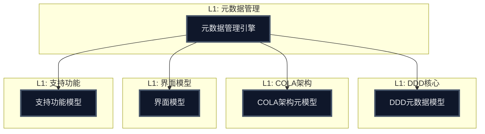

#### 1.1.2 第二层级：DDD核心详细展开

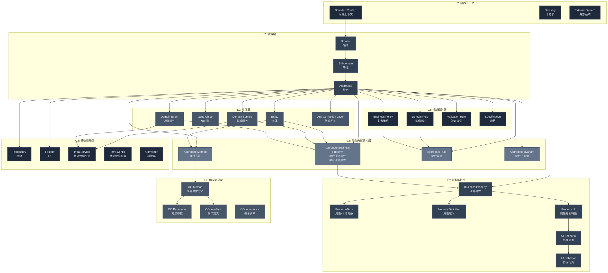

#### 1.1.2.1 DDD核心概念说明

##### **聚合内部结构 (Aggregate Internal Structure)**
- **Aggregate Business Property**：聚合的业务属性（聚焦领域概念）
- **Aggregate Method**：聚合的方法定义（业务操作）
- **Aggregate Rule**：聚合的业务规则（继承自领域规则）
- **Aggregate Invariant**：聚合的不变量（业务约束）

##### **业务属性层 (Business Property Layer)**
- **Business Property**：业务属性（术语具象化为具体数据类型）
- **Property-Term**：属性与术语的关系
- **Property Definition**：属性定义（数据类型、约束、必填性、默认值等）
- **Property UI**：属性界面特性（基础界面配置）
- **UI Scenario**：界面场景（详情页、表单页、列表页等）
- **UI Behavior**：界面行为（根据场景动态变化的界面表现）

##### **场景驱动的界面行为**
- **界面场景**：定义不同的使用场景（详情、编辑、创建、列表等）
- **界面行为**：根据场景动态调整属性的界面表现
- **动态配置**：同一属性在不同场景下有不同的界面行为

##### **领域规则 (Domain Rules)**
- **Domain Rule**：领域核心业务规则（跨聚合）
- **Business Policy**：业务策略和策略规则（跨聚合）
- **Validation Rule**：数据验证规则（跨聚合）
- **Specification**：查询和验证规格（跨聚合）

##### **层次关系说明**
- **聚合业务属性** → **业务属性**：聚合中的业务概念映射到通用业务属性
- **业务属性** 隐藏了数据类型等技术细节，聚焦业务含义
- **领域规则** → **聚合规则**：领域规则在聚合中的具体实现
- **聚合规则** 是 **领域规则** 在特定聚合中的具体化

##### **概念澄清**
- **Repository**、**Factory** 属于基础设施层，不是DDD核心概念
- **Method**、**Method Parameter** 是面向对象概念，不是DDD概念
- **Property-Term**、**Property Domain** 等是数据建模概念，不是DDD概念

##### **新增分层说明**

###### **数据建模层 (Data Modeling Layer)**
- **Data Property**：数据属性定义
- **Data Type**：数据类型（String、Integer、Decimal等）
- **Data Constraint**：数据约束（长度、值域等）
- **Data Dictionary**：数据字典（系统内置/用户自定义）
- **Data List**：数据列表（系统内置/用户自定义）

###### **面向对象层 (Object-Oriented Layer)**
- **OO Method**：面向对象方法定义
- **OO Parameter**：方法参数定义
- **OO Interface**：接口定义
- **OO Inheritance**：继承关系定义

###### **基础设施层 (Infrastructure Layer)**
- **Repository**：数据访问仓储
- **Factory**：对象创建工厂
- **Infra Service**：基础设施服务
- **Infra Config**：基础设施配置

#### 1.1.3 第二层级：COLA架构详细展开

##### 1.1.3.1 COLA架构概要层

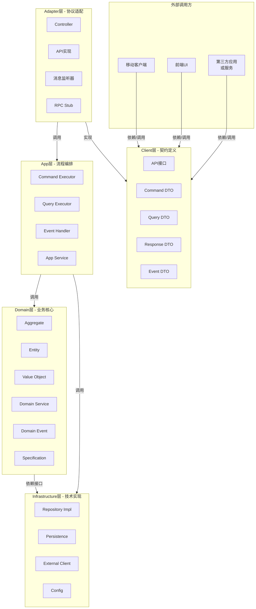

##### 1.1.3.2 COLA架构：Client层细分

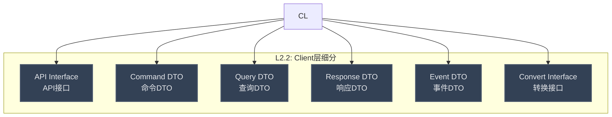

##### 1.1.3.3 COLA架构：Adapter层细分

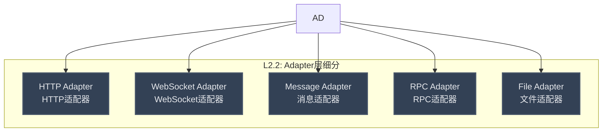

##### 1.1.3.4 COLA架构：App层细分

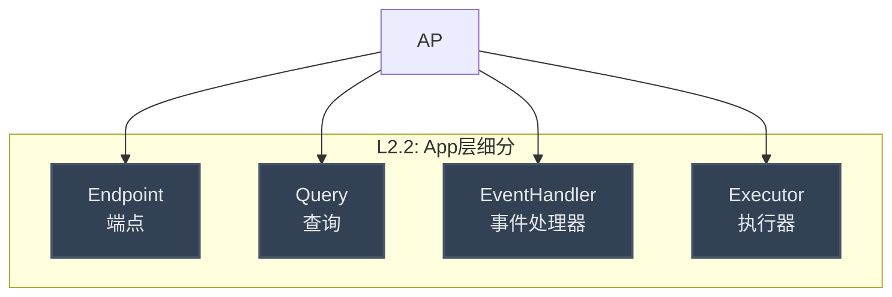

##### 1.1.3.5 COLA架构：参数层细分

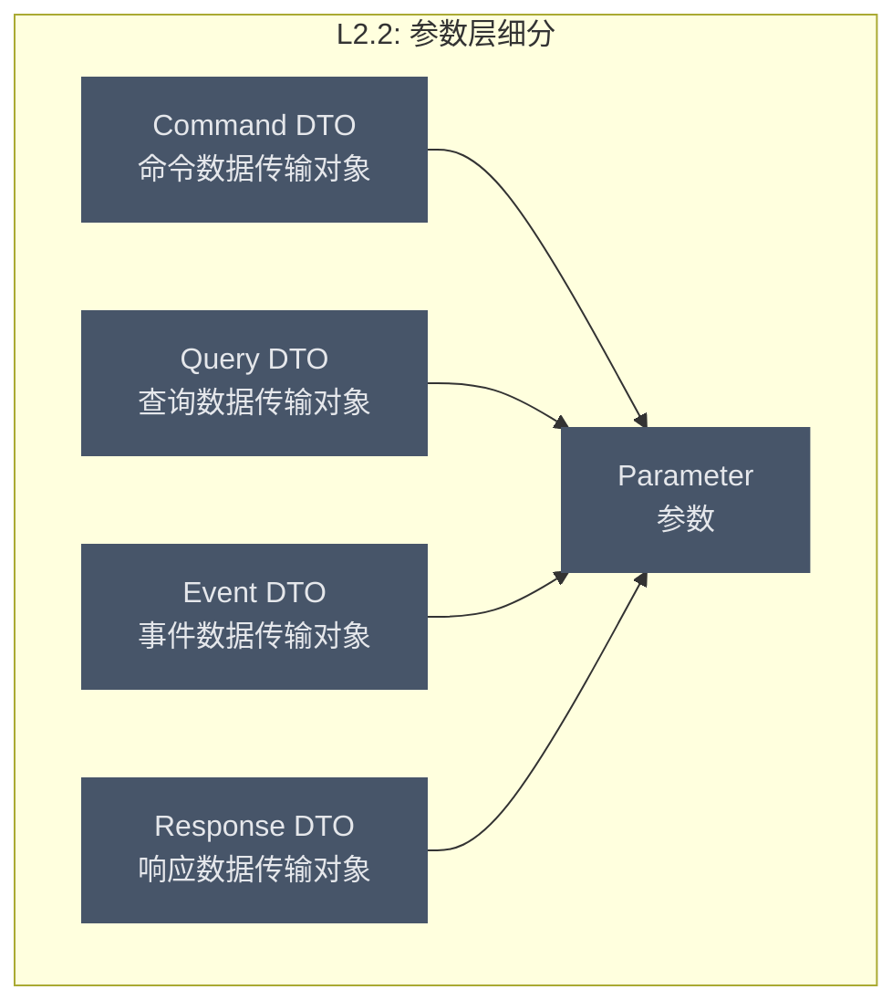

##### 1.1.3.6 COLA架构：Infrastructure层细分

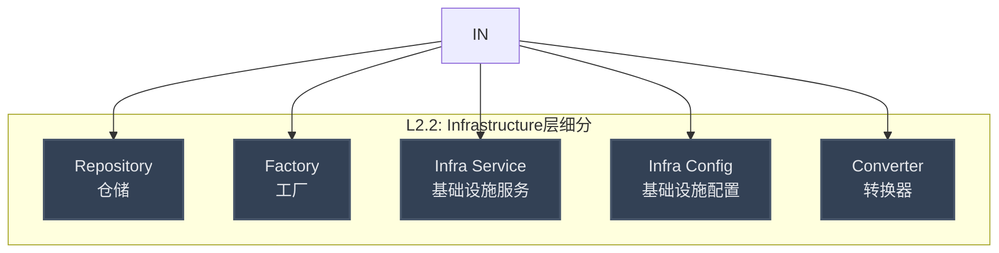
    
    %% 注意：各层的详细连接关系已在上述各小章节中展示
```

#### 1.1.4 第二层级：界面模型详细展开

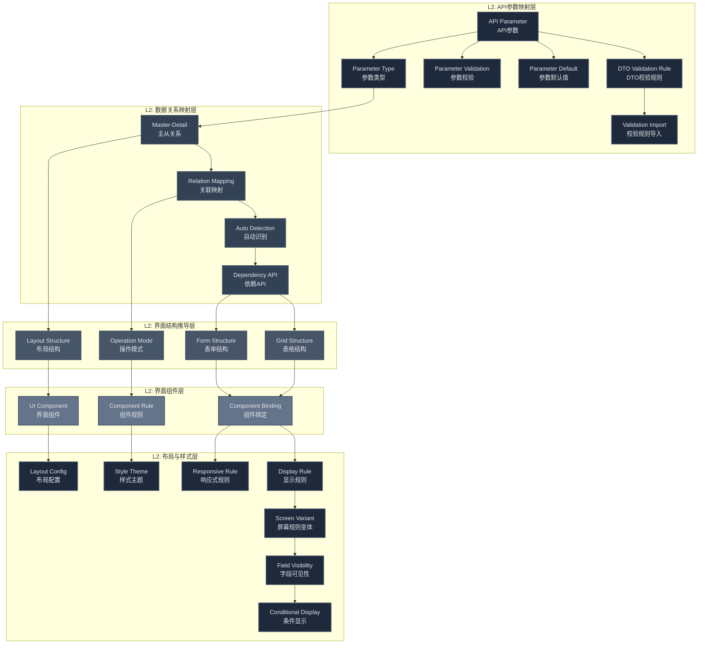

#### 1.1.5 第二层级：支持功能详细展开

```mermaid
graph TB
    %% 第二层级：支持功能详细展开
    subgraph "L2: 多语言支持"
        ML_L[Language Config<br/>语言配置]
        ML_T[Localized Text<br/>本地化文本]
        ML_TERM[Localized Term<br/>本地化术语]
    end
    
    subgraph "L2: SaaS支持"
        SAAS_T[Tenant<br/>租户]
        SAAS_C[Tenant Config<br/>租户配置]
        SAAS_I[Tenant Isolation<br/>租户隔离]
    end
    
    subgraph "L2: 消息管理"
        MSG_T[Message Template<br/>消息模板]
        MSG_C[Message Config<br/>消息配置]
        MSG_R[Message Record<br/>消息记录]
    end
    
    subgraph "L2: 校验规则"
        VR_R[Validation Rule<br/>校验规则]
        VR_G[Validation Group<br/>校验组]
        VR_B[Validation Binding<br/>校验绑定]
    end
    
    subgraph "L2: 复杂度管理"
        CM_C[Complexity Config<br/>复杂度配置]
    end
    
    %% L2层级连接关系
    ML_L --> ML_T
    ML_L --> ML_TERM
    
    SAAS_T --> SAAS_C
    SAAS_T --> SAAS_I
    
    MSG_T --> MSG_C
    MSG_C --> MSG_R
    
    VR_R --> VR_G
    VR_G --> VR_B
    
    %% 样式定义 - 使用科技深蓝主题配色
    classDef l2MultilingualLayer fill:#1e293b,stroke:#475569,stroke-width:2px,color:#E5E7EB
    classDef l2SaaSLayer fill:#334155,stroke:#475569,stroke-width:2px,color:#E5E7EB
    classDef l2MessageLayer fill:#475569,stroke:#475569,stroke-width:2px,color:#E5E7EB
    classDef l2ValidationLayer fill:#64748b,stroke:#475569,stroke-width:2px,color:#E5E7EB
    classDef l2ComplexityLayer fill:#1e293b,stroke:#475569,stroke-width:2px,color:#E5E7EB
    
    %% 样式应用
    class ML_L,ML_T,ML_TERM l2MultilingualLayer
    class SAAS_T,SAAS_C,SAAS_I l2SaaSLayer
    class MSG_T,MSG_C,MSG_R l2MessageLayer
    class VR_R,VR_G,VR_B l2ValidationLayer
    class CM_C l2ComplexityLayer
```

### 1.2 元数据模型关系图

#### 1.2.1 第一层级：高层关系概览

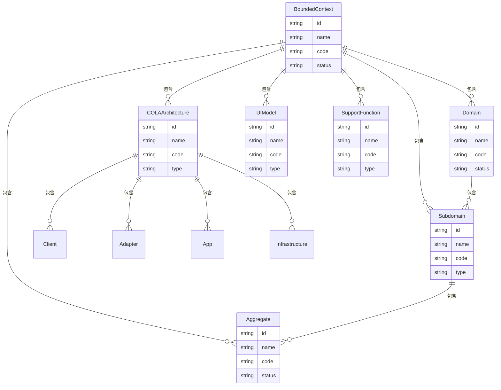

#### 1.2.2 第二层级：限界上下文详细展开

```mermaid
erDiagram
    %% 以限界上下文为主，展开其包含的所有L2层级内容
    BoundedContext ||--o{ Domain : "包含"
    BoundedContext ||--o{ Subdomain : "包含"
    BoundedContext ||--o{ Aggregate : "包含"
    BoundedContext ||--o{ Entity : "包含"
    BoundedContext ||--o{ ValueObject : "包含"
    BoundedContext ||--o{ DomainService : "包含"
    BoundedContext ||--o{ DomainEvent : "包含"
    BoundedContext ||--o{ Repository : "包含"
    BoundedContext ||--o{ Factory : "包含"
    BoundedContext ||--o{ Specification : "包含"
    BoundedContext ||--o{ Client : "包含"
    BoundedContext ||--o{ Adapter : "包含"
    BoundedContext ||--o{ App : "包含"
    BoundedContext ||--o{ Infrastructure : "包含"
    BoundedContext ||--o{ SDK : "包含"
    BoundedContext ||--o{ API : "包含"
    BoundedContext ||--o{ UIComponent : "包含"
    BoundedContext ||--o{ UIRule : "包含"
    BoundedContext ||--o{ LayoutStyle : "包含"
    BoundedContext ||--o{ LanguageConfig : "包含"
    BoundedContext ||--o{ Tenant : "包含"
    BoundedContext ||--o{ MessageTemplate : "包含"
    BoundedContext ||--o{ ValidationRule : "包含"
    BoundedContext ||--o{ ComplexityConfig : "包含"
    
    %% 限界上下文详细属性
    BoundedContext {
        string id
        string name
        string description
        string code
        string domainId
        string parentContextId
        int level
        int priority
        string status
        array ubiquitousLanguage
        object contextMap
        array integrationPatterns
        string tenantId
        string locale
        datetime createdTime
        datetime updatedTime
    }
    
    %% 其他实体仅显示关联对象，不展开详细属性
    Domain {
        string id
        string name
        string code
    }
    
    Subdomain {
        string id
        string name
        string code
    }
    
    Aggregate {
        string id
        string name
        string code
    }
    
    Entity {
        string id
        string name
        string code
    }
    
    ValueObject {
        string id
        string name
        string code
    }
    
    DomainService {
        string id
        string name
        string code
    }
    
    DomainEvent {
        string id
        string name
        string code
    }
    
    Repository {
        string id
        string name
        string code
    }
    
    Factory {
        string id
        string name
        string code
    }
    
    Specification {
        string id
        string name
        string code
    }
    
    Client {
        string id
        string name
        string code
    }
    
    Adapter {
        string id
        string name
        string code
    }
    
    App {
        string id
        string name
        string code
    }
    
    Infrastructure {
        string id
        string name
        string code
    }
    
    SDK {
        string id
        string name
        string code
    }
    
    API {
        string id
        string name
        string code
    }
    
    UIComponent {
        string id
        string name
        string code
    }
    
    UIRule {
        string id
        string name
        string code
    }
    
    LayoutStyle {
        string id
        string name
        string code
    }
    
    LanguageConfig {
        string id
        string name
        string code
    }
    
    Tenant {
        string id
        string name
        string code
    }
    
    MessageTemplate {
        string id
        string name
        string code
    }
    
    ValidationRule {
        string id
        string name
        string code
    }
    
    ComplexityConfig {
        string id
        string name
        string code
    }
```

#### 1.2.3 第二层级：聚合详细展开

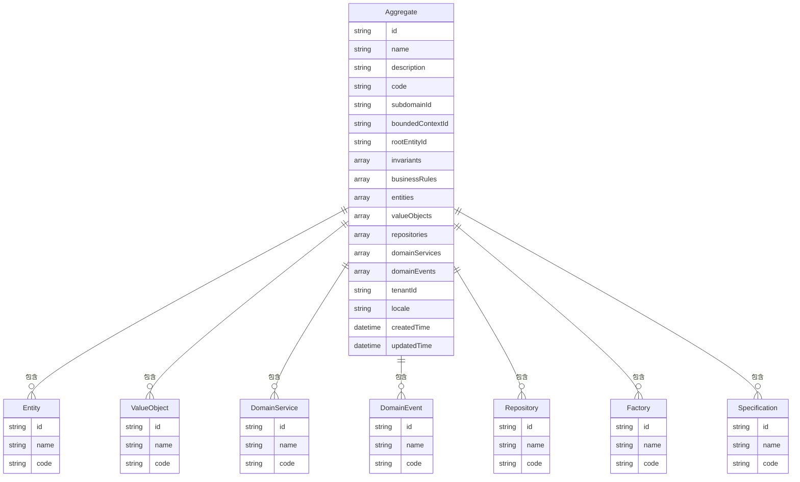

#### 1.2.4 第二层级：实体详细展开

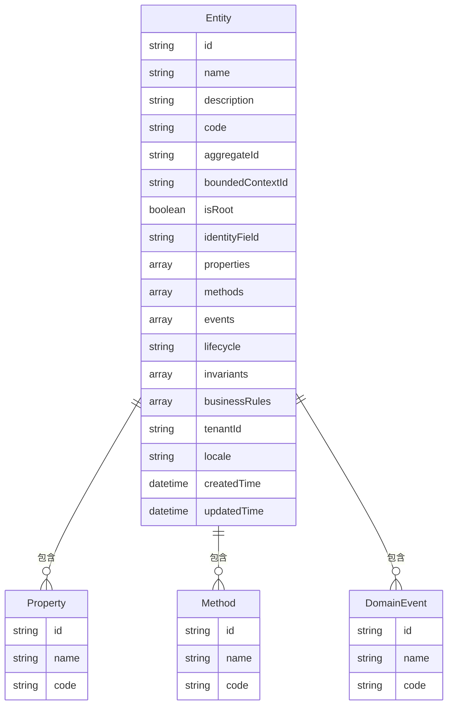

#### 1.2.5 第二层级：App层详细展开

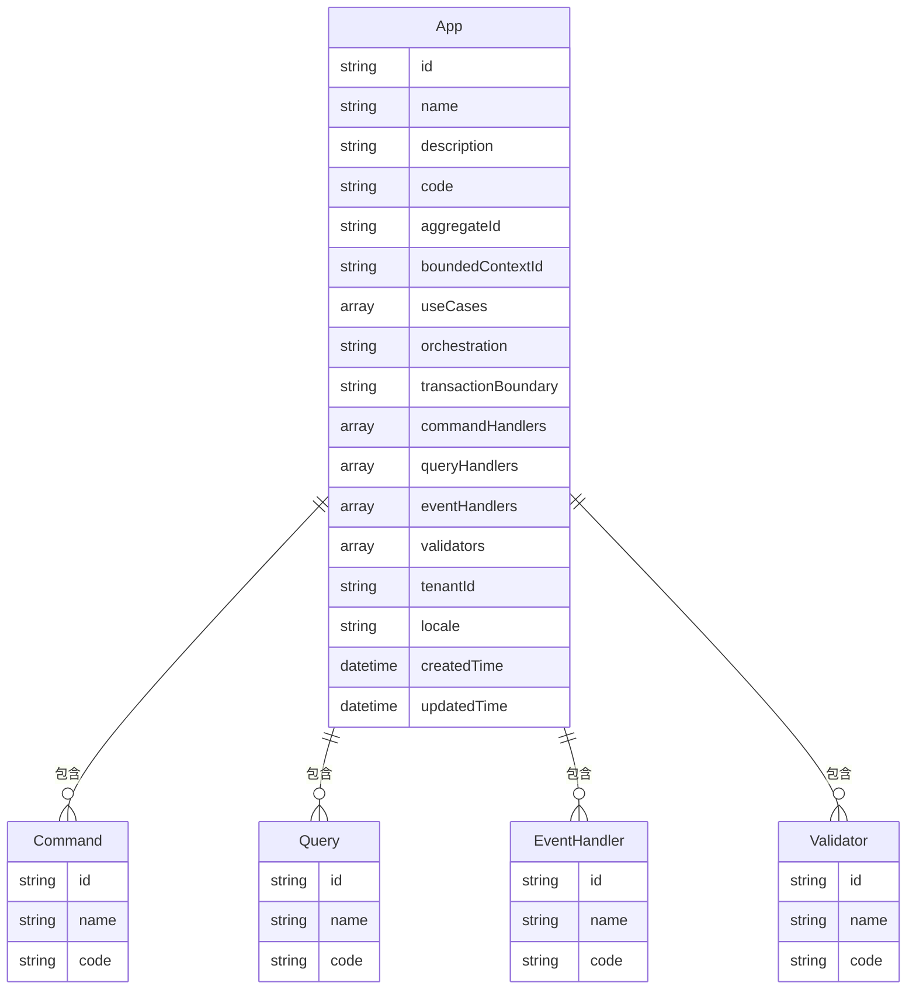

### 1.3 元数据模型分类说明

#### **DDD元数据模型（第2-4章）**
- **限界上下文层**：作为所有元数据的顶层容器，定义业务边界
- **领域层**：定义业务领域和子域的组织结构
- **聚合层**：定义业务聚合和聚合根
- **实体层**：定义业务实体、值对象、领域服务和领域事件
- **属性层**：定义实体的属性、方法、仓储、工厂和规格

#### **COLA架构元模型（第3、5章）**
- **架构层**：定义Client、Adapter、App、Domain、Infrastructure等架构层次
- **详细属性层**：定义端点、命令、查询、事件处理器、验证器和转换器

#### **界面模型（第6章）**
- 定义界面组件、规则和布局样式

#### **支持功能模型（第7-11章）**
- 多语言支持、SaaS多租户、消息管理、校验规则和复杂度管理

## 2. DDD元数据模型

### 2.1 限界上下文（Bounded Context）

```json
{
  "id": "string",
  "name": "string",
  "description": "string",
  "code": "string",
  "domainId": "string",
  "parentContextId": "string",
  "level": "integer",
  "priority": "integer",
  "status": "enum(ACTIVE,INACTIVE,DEPRECATED)",
  "ubiquitousLanguage": ["string"],
  "contextMap": "object",
  "integrationPatterns": ["string"],
  "tenantId": "string",
  "locale": "string",
  "createdTime": "datetime",
  "updatedTime": "datetime"
}
```

### 2.2 术语表（Glossary）

```json
{
  "id": "string",
  "name": "string",
  "description": "string",
  "code": "string",
  "boundedContextId": "string",
  "domainId": "string",
  "subdomainId": "string",
  "scope": "enum(GLOBAL,DOMAIN,SUBDOMAIN,CONTEXT)",
  "synonyms": ["string"],
  "definition": "string",
  "examples": ["string"],
  "relatedTerms": ["string"],
  "version": "string",
  "status": "enum(DRAFT,APPROVED,DEPRECATED)",
  "tenantId": "string",
  "locale": "string",
  "createdTime": "datetime",
  "updatedTime": "datetime"
}
```

### 2.3 领域（Domain）

```json
{
  "id": "string",
  "name": "string",
  "description": "string",
  "code": "string",
  "parentDomainId": "string",
  "level": "integer",
  "priority": "integer",
  "status": "enum(ACTIVE,INACTIVE,DEPRECATED)",
  "boundedContexts": ["string"],
  "subdomains": ["string"],
  "aggregates": ["string"],
  "domainServices": ["string"],
  "domainEvents": ["string"],
  "tenantId": "string",
  "locale": "string",
  "createdTime": "datetime",
  "updatedTime": "datetime"
}
```

### 2.4 子域（Subdomain）

```json
{
  "id": "string",
  "name": "string",
  "description": "string",
  "code": "string",
  "domainId": "string",
  "boundedContextId": "string",
  "type": "enum(CORE,SUPPORTING,GENERIC)",
  "priority": "integer",
  "status": "enum(ACTIVE,INACTIVE,DEPRECATED)",
  "aggregates": ["string"],
  "domainServices": ["string"],
  "domainEvents": ["string"],
  "tenantId": "string",
  "locale": "string",
  "createdTime": "datetime",
  "updatedTime": "datetime"
}
```

### 2.5 聚合（Aggregate）

```json
{
  "id": "string",
  "name": "string",
  "description": "string",
  "code": "string",
  "subdomainId": "string",
  "boundedContextId": "string",
  "rootEntityId": "string",
  "invariants": ["string"],
  "businessRules": ["string"],
  "entities": ["string"],
  "valueObjects": ["string"],
  "repositories": ["string"],
  "domainServices": ["string"],
  "domainEvents": ["string"],
  "tenantId": "string",
  "locale": "string",
  "createdTime": "datetime",
  "updatedTime": "datetime"
}
```

### 2.6 实体（Entity）

```json
{
  "id": "string",
  "name": "string",
  "description": "string",
  "code": "string",
  "aggregateId": "string",
  "boundedContextId": "string",
  "isRoot": "boolean",
  "identityField": "string",
  "properties": ["string"],
  "methods": ["string"],
  "events": ["string"],
  "lifecycle": "enum(CREATED,ACTIVE,INACTIVE,DELETED)",
  "invariants": ["string"],
  "businessRules": ["string"],
  "tenantId": "string",
  "locale": "string",
  "createdTime": "datetime",
  "updatedTime": "datetime"
}
```

### 2.7 值对象（Value Object）

```json
{
  "id": "string",
  "name": "string",
  "description": "string",
  "code": "string",
  "aggregateId": "string",
  "boundedContextId": "string",
  "properties": ["string"],
  "validationRules": ["string"],
  "immutable": "boolean",
  "equalityRules": "string",
  "tenantId": "string",
  "locale": "string",
  "createdTime": "datetime",
  "updatedTime": "datetime"
}
```

### 2.8 防腐网关（Anti-Corruption Layer）

```json
{
  "id": "string",
  "name": "string",
  "description": "string",
  "code": "string",
  "aggregateId": "string",
  "boundedContextId": "string",
  "externalSystemId": "string",
  "translationRules": ["string"],
  "adapters": ["string"],
  "mappingStrategies": ["string"],
  "tenantId": "string",
  "locale": "string",
  "createdTime": "datetime",
  "updatedTime": "datetime"
}
```

### 2.9 领域服务（Domain Service）

```json
{
  "id": "string",
  "name": "string",
  "description": "string",
  "code": "string",
  "aggregateId": "string",
  "boundedContextId": "string",
  "inputParameters": ["string"],
  "outputParameters": ["string"],
  "businessLogic": "string",
  "invariants": ["string"],
  "businessRules": ["string"],
  "dependencies": ["string"],
  "complexityLevel": "enum(SIMPLE,MEDIUM,COMPLEX)",
  "isPluginRequired": "boolean",
  "pluginId": "string",
  "tenantId": "string",
  "locale": "string",
  "createdTime": "datetime",
  "updatedTime": "datetime"
}
```

### 2.10 领域事件（Domain Event）

```json
{
  "id": "string",
  "name": "string",
  "description": "string",
  "code": "string",
  "aggregateId": "string",
  "boundedContextId": "string",
  "eventType": "string",
  "payload": "object",
  "payloadSchema": "object",
  "handlers": ["string"],
  "publishStrategy": "enum(SYNC,ASYNC,TRANSACTIONAL)",
  "eventVersion": "string",
  "isDeprecated": "boolean",
  "tenantId": "string",
  "locale": "string",
  "createdTime": "datetime",
  "updatedTime": "datetime"
}
```

### 2.11 外部系统（External System）

```json
{
  "id": "string",
  "name": "string",
  "description": "string",
  "code": "string",
  "boundedContextId": "string",
  "systemType": "enum(API,DATABASE,MESSAGE_QUEUE,FILE_SYSTEM)",
  "endpoint": "string",
  "authentication": "object",
  "protocol": "string",
  "version": "string",
  "status": "enum(ACTIVE,INACTIVE,DEPRECATED)",
  "tenantId": "string",
  "locale": "string",
  "createdTime": "datetime",
  "updatedTime": "datetime"
}
```

## 3. COLA架构元模型

### 3.1 Client层元模型

```json
{
  "id": "string",
  "name": "string",
  "description": "string",
  "code": "string",
  "type": "enum(WEB_CLIENT,MOBILE_CLIENT,DESKTOP_CLIENT,API_CLIENT)",
  "aggregateId": "string",
  "boundedContextId": "string",
  "endpoints": ["string"],
  "authentication": "object",
  "authorization": "object",
  "rateLimiting": "object",
  "tenantId": "string",
  "locale": "string",
  "createdTime": "datetime",
  "updatedTime": "datetime"
}
```

### 3.2 Adapter层元模型

```json
{
  "id": "string",
  "name": "string",
  "description": "string",
  "code": "string",
  "type": "enum(CONTROLLER,CONVERTER,RESPONSE,EXCEPTION_HANDLER)",
  "aggregateId": "string",
  "boundedContextId": "string",
  "endpoints": ["string"],
  "requestMapping": "string",
  "responseMapping": "string",
  "validationRules": ["string"],
  "authentication": "object",
  "authorization": "object",
  "rateLimiting": "object",
  "tenantId": "string",
  "locale": "string",
  "createdTime": "datetime",
  "updatedTime": "datetime"
}
```

### 3.3 App层元模型

```json
{
  "id": "string",
  "name": "string",
  "description": "string",
  "code": "string",
  "aggregateId": "string",
  "boundedContextId": "string",
  "useCases": ["string"],
  "orchestration": "string",
  "transactionBoundary": "string",
  "commandHandlers": ["string"],
  "queryHandlers": ["string"],
  "eventHandlers": ["string"],
  "validators": ["string"],
  "tenantId": "string",
  "locale": "string",
  "createdTime": "datetime",
  "updatedTime": "datetime"
}
```

### 3.4 Domain层元模型

```json
{
  "id": "string",
  "name": "string",
  "description": "string",
  "code": "string",
  "aggregateId": "string",
  "boundedContextId": "string",
  "entities": ["string"],
  "valueObjects": ["string"],
  "domainServices": ["string"],
  "repositories": ["string"],
  "businessRules": ["string"],
  "invariants": ["string"],
  "domainEvents": ["string"],
  "tenantId": "string",
  "locale": "string",
  "createdTime": "datetime",
  "updatedTime": "datetime"
}
```

### 3.5 Infrastructure层元模型

```json
{
  "id": "string",
  "name": "string",
  "description": "string",
  "code": "string",
  "aggregateId": "string",
  "boundedContextId": "string",
  "repositories": ["string"],
  "externalServices": ["string"],
  "messageQueues": ["string"],
  "caches": ["string"],
  "configurations": ["string"],
  "tenantId": "string",
  "locale": "string",
  "createdTime": "datetime",
  "updatedTime": "datetime"
}
```

### 3.6 SDK元模型

```json
{
  "id": "string",
  "name": "string",
  "description": "string",
  "code": "string",
  "boundedContextId": "string",
  "version": "string",
  "languages": ["string"],
  "dependencies": ["string"],
  "apiEndpoints": ["string"],
  "authentication": "object",
  "rateLimiting": "object",
  "documentation": "string",
  "tenantId": "string",
  "locale": "string",
  "createdTime": "datetime",
  "updatedTime": "datetime"
}
```

### 3.7 API元模型

```json
{
  "id": "string",
  "name": "string",
  "description": "string",
  "code": "string",
  "boundedContextId": "string",
  "version": "string",
  "baseUrl": "string",
  "endpoints": ["string"],
  "authentication": "object",
  "authorization": "object",
  "rateLimiting": "object",
  "documentation": "string",
  "tenantId": "string",
  "locale": "string",
  "createdTime": "datetime",
  "updatedTime": "datetime"
}
```

## 4. DDD详细属性定义模型

### 4.1 属性模型（Property）

```json
{
  "id": "string",
  "name": "string",
  "description": "string",
  "code": "string",
  "entityId": "string",
  "boundedContextId": "string",
  "dataType": "string",
  "constraints": "object",
  "defaultValue": "any",
  "validationRules": ["string"],
  "uiConfig": "object",
  "isRequired": "boolean",
  "isUnique": "boolean",
  "isIndexed": "boolean",
  "isEncrypted": "boolean",
  "tenantId": "string",
  "locale": "string",
  "createdTime": "datetime",
  "updatedTime": "datetime"
}
```

### 4.2 方法模型（Method）

```json
{
  "id": "string",
  "name": "string",
  "description": "string",
  "code": "string",
  "entityId": "string",
  "boundedContextId": "string",
  "inputParameters": ["string"],
  "outputParameters": ["string"],
  "businessLogic": "string",
  "invariants": ["string"],
  "businessRules": ["string"],
  "complexityLevel": "enum(SIMPLE,MEDIUM,COMPLEX)",
  "isPluginRequired": "boolean",
  "pluginId": "string",
  "tenantId": "string",
  "locale": "string",
  "createdTime": "datetime",
  "updatedTime": "datetime"
}
```

### 4.3 方法参数模型（MethodParameter）

```json
{
  "id": "string",
  "name": "string",
  "description": "string",
  "code": "string",
  "methodId": "string",
  "boundedContextId": "string",
  "parameterType": "enum(INPUT,OUTPUT)",
  "dataType": "string",
  "isRequired": "boolean",
  "defaultValue": "any",
  "validationRules": ["string"],
  "order": "integer",
  "tenantId": "string",
  "locale": "string",
  "createdTime": "datetime",
  "updatedTime": "datetime"
}
```

### 4.4 仓储模型（Repository）

```json
{
  "id": "string",
  "name": "string",
  "description": "string",
  "code": "string",
  "aggregateId": "string",
  "boundedContextId": "string",
  "interfaceName": "string",
  "implementationName": "string",
  "queryMethods": ["string"],
  "commandMethods": ["string"],
  "tenantId": "string",
  "locale": "string",
  "createdTime": "datetime",
  "updatedTime": "datetime"
}
```

### 4.5 工厂模型（Factory）

```json
{
  "id": "string",
  "name": "string",
  "description": "string",
  "code": "string",
  "aggregateId": "string",
  "boundedContextId": "string",
  "factoryType": "enum(AGGREGATE,ENTITY,VALUE_OBJECT)",
  "creationMethods": ["string"],
  "validationRules": ["string"],
  "tenantId": "string",
  "locale": "string",
  "createdTime": "datetime",
  "updatedTime": "datetime"
}
```

### 4.6 规格模型（Specification）

```json
{
  "id": "string",
  "name": "string",
  "description": "string",
  "code": "string",
  "aggregateId": "string",
  "boundedContextId": "string",
  "expression": "string",
  "parameters": ["string"],
  "isComposite": "boolean",
  "compositeOperator": "enum(AND,OR,NOT)",
  "tenantId": "string",
  "locale": "string",
  "createdTime": "datetime",
  "updatedTime": "datetime"
}
```

## 5. COLA架构详细属性定义模型

### 5.1 端点模型（Endpoint）

```json
{
  "id": "string",
  "name": "string",
  "description": "string",
  "code": "string",
  "adapterId": "string",
  "boundedContextId": "string",
  "httpMethod": "enum(GET,POST,PUT,DELETE,PATCH)",
  "path": "string",
  "inputSchema": "object",
  "outputSchema": "object",
  "validationRules": ["string"],
  "authentication": "object",
  "authorization": "object",
  "rateLimiting": "object",
  "tenantId": "string",
  "locale": "string",
  "createdTime": "datetime",
  "updatedTime": "datetime"
}
```

### 5.2 命令模型（Command）

```json
{
  "id": "string",
  "name": "string",
  "description": "string",
  "code": "string",
  "appId": "string",
  "aggregateId": "string",
  "boundedContextId": "string",
  "inputSchema": "object",
  "validationRules": ["string"],
  "handler": "string",
  "tenantId": "string",
  "locale": "string",
  "createdTime": "datetime",
  "updatedTime": "datetime"
}
```

### 5.3 查询模型（Query）

```json
{
  "id": "string",
  "name": "string",
  "description": "string",
  "code": "string",
  "appId": "string",
  "aggregateId": "string",
  "boundedContextId": "string",
  "inputSchema": "object",
  "outputSchema": "object",
  "handler": "string",
  "tenantId": "string",
  "locale": "string",
  "createdTime": "datetime",
  "updatedTime": "datetime"
}
```

### 5.4 事件处理器模型（EventHandler）

```json
{
  "id": "string",
  "name": "string",
  "description": "string",
  "code": "string",
  "appId": "string",
  "eventId": "string",
  "boundedContextId": "string",
  "handlerType": "enum(SYNC,ASYNC,TRANSACTIONAL)",
  "handler": "string",
  "priority": "integer",
  "tenantId": "string",
  "locale": "string",
  "createdTime": "datetime",
  "updatedTime": "datetime"
}
```

### 5.5 验证器模型（Validator）

```json
{
  "id": "string",
  "name": "string",
  "description": "string",
  "code": "string",
  "appId": "string",
  "targetType": "enum(COMMAND,QUERY,ENTITY,PROPERTY)",
  "targetId": "string",
  "boundedContextId": "string",
  "validationRules": ["string"],
  "customValidator": "string",
  "tenantId": "string",
  "locale": "string",
  "createdTime": "datetime",
  "updatedTime": "datetime"
}
```

### 5.6 转换器模型（Converter）

```json
{
  "id": "string",
  "name": "string",
  "description": "string",
  "code": "string",
  "adapterId": "string",
  "boundedContextId": "string",
  "sourceType": "string",
  "targetType": "string",
  "conversionRules": ["string"],
  "isBidirectional": "boolean",
  "tenantId": "string",
  "locale": "string",
  "createdTime": "datetime",
  "updatedTime": "datetime"
}
```

## 6. 界面模型

### 6.1 界面组件模型

```json
{
  "id": "string",
  "name": "string",
  "description": "string",
  "code": "string",
  "type": "enum(FORM,TABLE,CHART,NAVIGATION,DASHBOARD)",
  "componentType": "string",
  "properties": "object",
  "events": ["string"],
  "validationRules": ["string"],
  "styling": "object",
  "dataBinding": "object",
  "tenantId": "string",
  "locale": "string",
  "createdTime": "datetime",
  "updatedTime": "datetime"
}
```

### 6.2 界面规则模型

```json
{
  "id": "string",
  "name": "string",
  "description": "string",
  "code": "string",
  "componentId": "string",
  "ruleType": "enum(VISIBILITY,ENABLEMENT,VALIDATION,STYLING,BEHAVIOR)",
  "condition": "string",
  "action": "string",
  "priority": "integer",
  "isActive": "boolean",
  "tenantId": "string",
  "locale": "string",
  "createdTime": "datetime",
  "updatedTime": "datetime"
}
```

### 6.3 布局和样式模型

```json
{
  "id": "string",
  "name": "string",
  "description": "string",
  "code": "string",
  "layoutType": "enum(GRID,FLEXBOX,ABSOLUTE,RESPONSIVE)",
  "components": ["string"],
  "styling": "object",
  "responsiveRules": ["string"],
  "breakpoints": "object",
  "tenantId": "string",
  "locale": "string",
  "createdTime": "datetime",
  "updatedTime": "datetime"
}
```

## 7. 多语言支持模型

### 7.1 语言配置模型

```json
{
  "id": "string",
  "code": "string",
  "name": "string",
  "nativeName": "string",
  "direction": "enum(LTR,RTL)",
  "dateFormat": "string",
  "timeFormat": "string",
  "numberFormat": "string",
  "currencyFormat": "string",
  "isDefault": "boolean",
  "isActive": "boolean",
  "tenantId": "string",
  "createdTime": "datetime",
  "updatedTime": "datetime"
}
```

### 7.2 本地化文本模型

```json
{
  "id": "string",
  "key": "string",
  "locale": "string",
  "text": "string",
  "description": "string",
  "context": "string",
  "category": "string",
  "variables": ["string"],
  "tenantId": "string",
  "createdTime": "datetime",
  "updatedTime": "datetime"
}
```

### 7.3 多语言术语模型

```json
{
  "id": "string",
  "termKey": "string",
  "locale": "string",
  "term": "string",
  "definition": "string",
  "synonyms": ["string"],
  "examples": ["string"],
  "domain": "string",
  "boundedContext": "string",
  "tenantId": "string",
  "createdTime": "datetime",
  "updatedTime": "datetime"
}
```

## 8. SaaS支持模型

### 8.1 租户模型

```json
{
  "id": "string",
  "code": "string",
  "name": "string",
  "description": "string",
  "status": "enum(ACTIVE,INACTIVE,SUSPENDED)",
  "subscriptionPlan": "string",
  "maxUsers": "integer",
  "maxStorage": "integer",
  "features": ["string"],
  "settings": "object",
  "createdTime": "datetime",
  "updatedTime": "datetime"
}
```

### 8.2 租户配置模型

```json
{
  "id": "string",
  "tenantId": "string",
  "configKey": "string",
  "configValue": "any",
  "configType": "enum(STRING,NUMBER,BOOLEAN,JSON)",
  "description": "string",
  "isSystem": "boolean",
  "createdTime": "datetime",
  "updatedTime": "datetime"
}
```

### 8.3 租户隔离策略模型

```json
{
  "id": "string",
  "tenantId": "string",
  "resourceType": "enum(DATABASE,FILE,CACHE,QUEUE)",
  "isolationLevel": "enum(SCHEMA,TABLE,ROW)",
  "strategy": "string",
  "config": "object",
  "createdTime": "datetime",
  "updatedTime": "datetime"
}
```

## 9. 统一消息管理模型

### 9.1 消息模板模型

```json
{
  "id": "string",
  "code": "string",
  "name": "string",
  "description": "string",
  "type": "enum(EMAIL,SMS,PUSH,IN_APP)",
  "category": "string",
  "subject": "string",
  "content": "string",
  "variables": ["string"],
  "locale": "string",
  "tenantId": "string",
  "isActive": "boolean",
  "createdTime": "datetime",
  "updatedTime": "datetime"
}
```

### 9.2 消息发送配置模型

```json
{
  "id": "string",
  "tenantId": "string",
  "messageType": "enum(EMAIL,SMS,PUSH,IN_APP)",
  "provider": "string",
  "config": "object",
  "isDefault": "boolean",
  "isActive": "boolean",
  "createdTime": "datetime",
  "updatedTime": "datetime"
}
```

### 9.3 消息发送记录模型

```json
{
  "id": "string",
  "tenantId": "string",
  "templateId": "string",
  "recipient": "string",
  "subject": "string",
  "content": "string",
  "variables": "object",
  "status": "enum(PENDING,SENT,FAILED,DELIVERED)",
  "provider": "string",
  "providerMessageId": "string",
  "errorMessage": "string",
  "sentTime": "datetime",
  "deliveredTime": "datetime",
  "createdTime": "datetime"
}
```

## 10. 统一校验规则模型

### 10.1 校验规则模型

```json
{
  "id": "string",
  "name": "string",
  "description": "string",
  "code": "string",
  "ruleType": "enum(FIELD,ENTITY,BUSINESS,CROSS_AGGREGATE)",
  "expression": "string",
  "errorMessage": "string",
  "severity": "enum(ERROR,WARNING,INFO)",
  "priority": "integer",
  "isActive": "boolean",
  "targetType": "enum(ENTITY,FIELD,OPERATION,AGGREGATE)",
  "targetId": "string",
  "tenantId": "string",
  "locale": "string",
  "createdTime": "datetime",
  "updatedTime": "datetime"
}
```

### 10.2 校验规则组模型

```json
{
  "id": "string",
  "name": "string",
  "description": "string",
  "code": "string",
  "rules": ["string"],
  "executionOrder": "enum(SEQUENTIAL,PARALLEL)",
  "stopOnFirstError": "boolean",
  "isActive": "boolean",
  "tenantId": "string",
  "locale": "string",
  "createdTime": "datetime",
  "updatedTime": "datetime"
}
```

### 10.3 校验规则绑定模型

```json
{
  "id": "string",
  "ruleId": "string",
  "targetType": "enum(ENTITY,FIELD,OPERATION,AGGREGATE)",
  "targetId": "string",
  "trigger": "enum(CREATE,UPDATE,DELETE,VALIDATE,EXECUTE)",
  "isActive": "boolean",
  "tenantId": "string",
  "createdTime": "datetime",
  "updatedTime": "datetime"
}
```

## 11. 复杂度管理模型

### 11.1 复杂度配置模型

```json
{
  "id": "string",
  "name": "string",
  "description": "string",
  "code": "string",
  "targetType": "enum(DOMAIN_SERVICE,METHOD,BUSINESS_LOGIC)",
  "targetId": "string",
  "complexityLevel": "enum(SIMPLE,MEDIUM,COMPLEX)",
  "isPluginRequired": "boolean",
  "pluginId": "string",
  "reason": "string",
  "configuredBy": "string",
  "configuredTime": "datetime",
  "tenantId": "string",
  "locale": "string",
  "createdTime": "datetime",
  "updatedTime": "datetime"
}
```

## 12. JSON Schema支持

### 12.1 导入功能

- 支持从JSON Schema文件导入元数据定义
- 自动解析数据类型、约束和验证规则
- 生成对应的DDD和COLA元模型
- 支持多语言和SaaS配置导入

### 12.2 导出功能

- 将元数据模型导出为JSON Schema格式
- 支持版本控制和差异比较
- 支持按租户和语言导出
- 便于与其他系统集成

## 13. 元数据关系图

```
BoundedContext (1) -> (N) Domain
BoundedContext (1) -> (N) Subdomain
BoundedContext (1) -> (N) Aggregate
BoundedContext (1) -> (N) Entity
BoundedContext (1) -> (N) ValueObject
BoundedContext (1) -> (N) DomainService
BoundedContext (1) -> (N) DomainEvent
BoundedContext (1) -> (N) Property
BoundedContext (1) -> (N) Method
BoundedContext (1) -> (N) MethodParameter
BoundedContext (1) -> (N) Repository
BoundedContext (1) -> (N) Factory
BoundedContext (1) -> (N) Specification

Domain (1) -> (N) Subdomain
Domain (1) -> (N) Aggregate
Domain (1) -> (N) DomainService
Domain (1) -> (N) DomainEvent

Subdomain (1) -> (N) Aggregate
Subdomain (1) -> (N) DomainService
Subdomain (1) -> (N) DomainEvent

Aggregate (1) -> (N) Entity
Aggregate (1) -> (N) ValueObject
Aggregate (1) -> (N) DomainService
Aggregate (1) -> (N) DomainEvent
Aggregate (1) -> (N) Repository
Aggregate (1) -> (N) Factory
Aggregate (1) -> (N) Specification

Entity (1) -> (N) Property
Entity (1) -> (N) Method
Entity (1) -> (N) Event

Method (1) -> (N) MethodParameter

App (1) -> (N) Command
App (1) -> (N) Query
App (1) -> (N) EventHandler
App (1) -> (N) Validator

Adapter (1) -> (N) Endpoint
Adapter (1) -> (N) Converter

Client (1) -> (N) Endpoint

Locale (1) -> (N) LocalizedText
Locale (1) -> (N) LocalizedTerm
Tenant (1) -> (N) TenantConfig
Tenant (1) -> (N) MessageTemplate
Tenant (1) -> (N) ValidationRule
```

## 14. 扩展性设计

### 14.1 插件化架构

- 支持自定义元数据类型
- 支持自定义验证规则
- 支持自定义消息发送器
- 支持自定义多语言处理器

### 14.2 版本管理

- 元数据版本控制
- 变更历史追踪
- 回滚和分支管理
- 租户配置版本管理

### 14.3 权限控制

- 基于角色的访问控制
- 元数据操作权限管理
- 租户隔离权限控制
- 审计日志记录

### 14.4 多租户支持

- 数据隔离策略
- 配置隔离管理
- 资源配额控制
- 租户间数据共享策略
